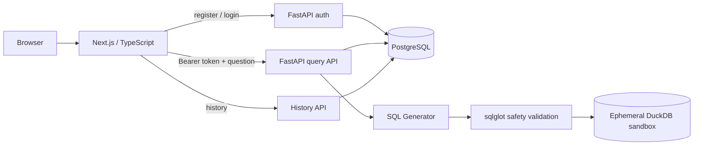

# sqlsmith

A **safe natural-language-to-SQL product** that combines a Next.js workspace, authenticated FastAPI API, persistent query history, and an AST-based read-only SQL safety layer.


## Week 6 — full-stack product foundation

The repository now has a real product shell around the original text-to-SQL core:

- **Next.js + TypeScript frontend** for registration/login, natural-language querying, SQL inspection, results, and recent history
- **FastAPI backend** with typed request/response contracts
- **JWT authentication** with PBKDF2-HMAC-SHA256 password hashing
- **PostgreSQL-backed application state** in Docker Compose for users and query history
- **DuckDB execution sandbox** kept separate from product persistence
- **AST safety layer** using `sqlglot` to reject write/DDL operations and stacked statements before execution
- **CI for both application layers**: Ruff, formatting, mypy, pytest, and a production Next.js build

The default generator remains deterministic and API-key-free so the product can be exercised locally and in CI. A real provider adapter exists, but model quality/evaluation is intentionally a Week 7 concern rather than a Week 6 claim.

## Architecture



There are deliberately **two database concerns**:

1. **PostgreSQL** stores product state such as users and query-history metadata.
2. **DuckDB** is an isolated execution sandbox for generated SQL. It is rebuilt independently of user/account persistence.

This separation keeps application data away from generated-query execution.

## Run the complete product

```bash
cp .env.example .env
docker compose up --build
```

Then open:

- Frontend: `http://localhost:3000`
- FastAPI docs: `http://localhost:8000/docs`

Docker Compose starts PostgreSQL first, waits for it to become healthy, then starts the API and finally the frontend.

## Backend-only development

```bash
make install
make dev        # http://localhost:8000/docs
make check      # ruff + mypy + pytest
```

Without Docker Compose, the default `DATABASE_URL` uses local SQLite so backend development does not require a running PostgreSQL server. The Compose stack switches the same persistence layer to PostgreSQL.

## Product flow

1. Register or sign in.
2. The API returns a signed bearer token.
3. Ask a natural-language question.
4. The configured generator produces SQL from the sandbox schema.
5. `sqlglot` parses the SQL and enforces the read-only policy.
6. Safe SQL executes against the isolated DuckDB dataset.
7. The response includes validated SQL, rows, and row count.
8. Query metadata is persisted against the authenticated user and appears in the history view.

Example authenticated query:

```bash
TOKEN="<token returned from /v1/auth/login>"

curl -X POST http://localhost:8000/v1/query \
  -H "Authorization: Bearer $TOKEN" \
  -H "Content-Type: application/json" \
  -d '{"question":"list all customers","execute":true}'
```

## Safety boundary

The model output is treated as **untrusted input**. Before execution, generated SQL is parsed as an AST rather than checked with a regular expression or prompt-only instruction. The current safety layer:

- allows a single read-only query
- rejects DML/DDL and stacked statements
- adds a configured row limit to unbounded selects
- executes accepted SQL only inside the DuckDB sandbox

This reduces the blast radius of generated SQL; it is not presented as a substitute for database permissions or production security controls.

## Authentication and persistence

Users are stored in the application database with salted PBKDF2 password hashes. Successful registration/login returns a signed JWT. Query and history routes require bearer authentication, and history is filtered by the authenticated user id.

For local Compose use, PostgreSQL is configured with development credentials. Real deployments should provide their own database credentials and a long random `JWT_SECRET` through secret management rather than committing them.

## Repository layout

```text
app/
  api/routes/         # health, auth, query, history
  db/                 # DuckDB sandbox + SQLAlchemy product persistence
  schemas/            # Pydantic API contracts
  sql/                # generator abstraction + SQL safety policy
  config.py           # typed environment configuration
  security.py         # password hashing + JWT helpers
frontend/
  app/                # Next.js App Router UI
  lib/api.ts          # typed API client
tests/                # backend contracts and SQL safety tests
Dockerfile             # non-root FastAPI image
docker-compose.yml     # PostgreSQL + API + web stack
```

## Current scope vs. next work

### Implemented now

- [x] end-to-end safe query vertical slice
- [x] authenticated product API
- [x] persistent per-user query history
- [x] PostgreSQL application persistence in Compose
- [x] Next.js/TypeScript workspace
- [x] backend tests and static quality gates
- [x] frontend production build validation

### Week 7

- [ ] production-quality LLM SQL generation and schema-aware prompting
- [ ] labeled evaluation dataset
- [ ] execution-accuracy evaluation harness
- [ ] richer dataset/schema context and structured generation metadata

### Weeks 8–9

- [ ] stronger production/security controls and broader integration tests
- [ ] deterministic frontend dependency locking and container gates
- [ ] rate limiting and structured operational errors
- [ ] deployment and managed PostgreSQL
- [ ] Langfuse/request observability and cost/latency telemetry

## Why this project exists

Many text-to-SQL demos stop at prompt → SQL. `sqlsmith` is being built as a product-shaped system where generated code must pass an explicit safety boundary, execution is isolated, user state is persisted separately, and model quality can later be measured objectively through execution accuracy.
